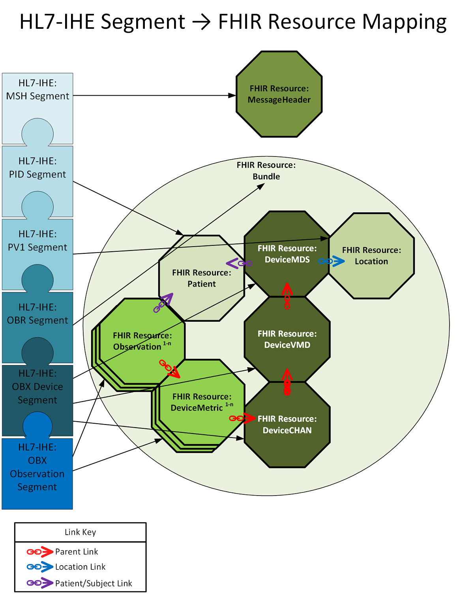
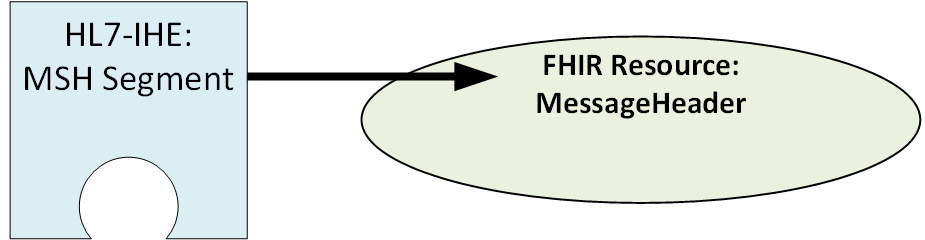
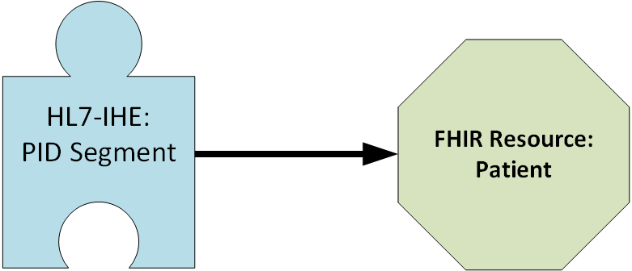
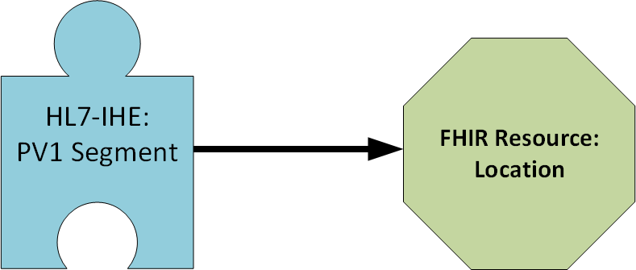
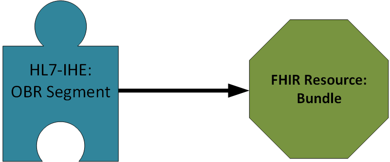
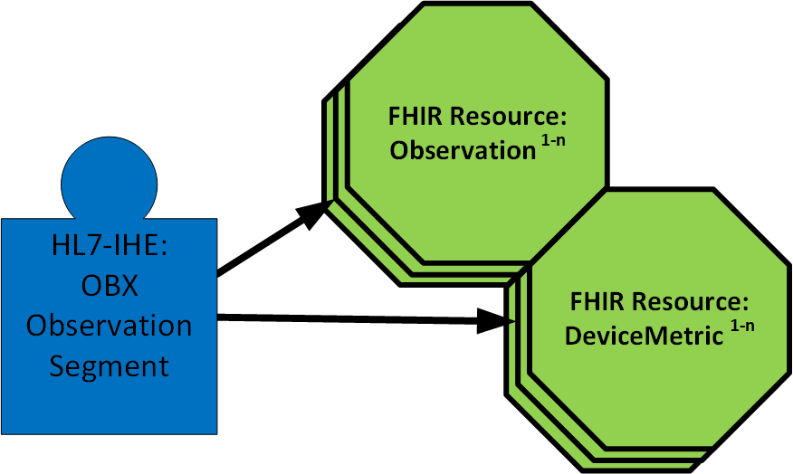
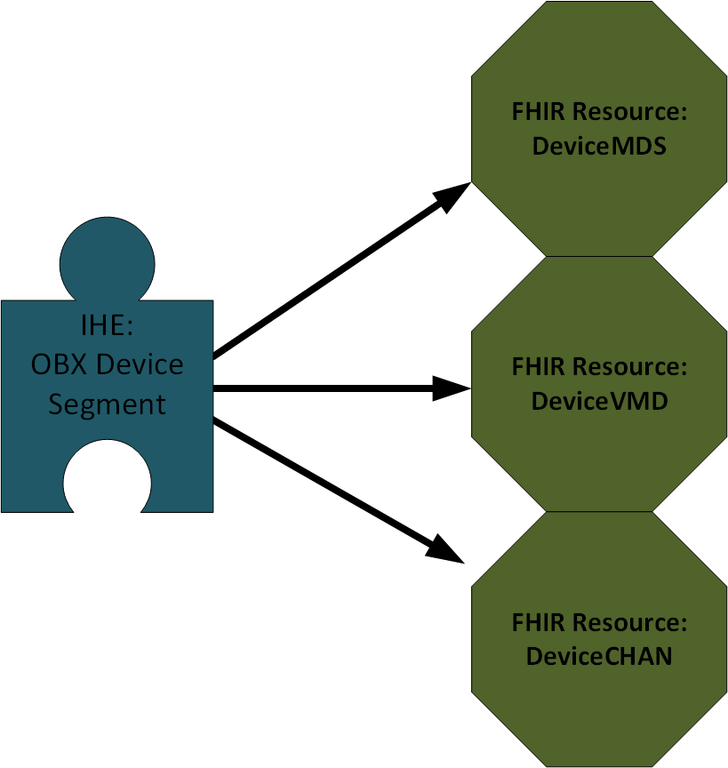

The following mapping information is based on the commonly-used PCD-01 transaction 
defined by the Integrating the Healthcare Enterprise Patient Care Device program
for reporting device data. 

It is not feasible to include all relevant details in this brief account.  
Refer to the detailed information in:

- the [HL7 Version 2.7 specification](http://www.hl7.eu/HL7v2x/v27/std27/hl7.html) for 
general details including descriptions
especially [Chapter 2.A](http://www.hl7.eu/HL7v2x/v27/std27/ch02a.html) for data types, 
which have some differences from FHIR data types

- The [IHE Patient Care Devices Technical Framework](https://www.ihe.net/resources/technical_frameworks/#dev), 
Volume 2, Transactions ([download PDF](https://www.ihe.net/uploadedFiles/Documents/PCD/IHE_PCD_TF_Vol2.pdf`), 
Section 3.x, for specifics on which
HL7 V2 segments and fields are used in the profile, their data types, and usage notes.
This document is the source of the information in the tables of this Guide.

The common use case for device data reporting is for a device or a device gateway to be responsible mainly for
the observations and ancillary data on the configuration and functioning of the devices themselves.
Primary responsibility for patient identity and location information is with other hospital information
systems. In many cases such data is available only by linking to resources provided by these other systems.
Some device systems and gateways will have limited information about patient identity and location.

The implementer of a system creating and organizing links among the FHIR resources
must use their understanding of the capabilities of the devices being interfaced,
the context or contexts for their implementation,
including the sources for authorative patient identity, location, and reliable information 
on the associations between particular patients and particular device instances
to making an adequate, patient-safe, set of FHIR resources within that context.

### Details Regarding FHIR resource mappings in the Patient Monitoring Context

Below shows segment to FHIR Resource Mapping

<!--{: .img-left}-->

### HL7 IHE Direct Compatibility to FHIR POCD:

<span style="color:blue">This FHIR POCD implementation guide has been developed specifically to be equivalent to HL7 IHE specifications.   Further, future IHE and FHIR specifications intend to capture equivalent data as well per HL7 org.  No data content should be lost or gained when moving from output format or the other.  </span>

<span style="color:blue">IHE compatibility:   FHIR messages can be converted directly from HL7 IHE messages.  This is critical to note.  That allows for patient monitoring context product(s) to natively generate FHIR POCD or simply convert existing HL7 IHE messages.  </span>

<span style="color:blue">Patient Monitoring product should offer both HL7 IHE messaging and equivalent FHIR messaging plus FHIR server communications.  This implementation guide will detail how patient monitoring HL7 IHE messages can be directly converted into FHIR.  This conversion capability will also support potential communication of parametric measurements to patient monitoring cloud products in a standardized manner.</span>

<span style="color:blue">This implementation guide also details what the patient monitoring contect FHIR POCD messaging would require if done natively - specifically the required fields.  Most important reason for this format equivalence is that HL7 IHE has many years of vendor support along with hospital integration(s).  IHE supports the patient data capture supporting hospital accreditation efforts through organizations such as JCAHO - which has clear accreditation requirements.  Examples are to properly define a minimum of 2 unique patient identifiers for each patient.  Further, capturing the exact device(s) which provided the measurement are necessary for correct traceability.  Patient measurements are rendered meaningless and have no clinical context without such traceability.</span>

### HL7 IHE Message Conversion to FHIR POCD:

<span style="color:blue">This guide intends to summarize the conversions from HL7 IHE V.2 messages to FHIR POCD directly.</span>

<span style="color:blue">Although FHIR supports multiple data exchange formats including XML and JSON, iX will use JSON format as it is more compact and yet readable.   Important to note that for each HL7 conversion segment that the mappings are detailed on the right side of each value presented.</span>

<span style="color:blue">FHIR defines “resources” corresponding to heathcare IT concepts like Patient and Device. It restricts contents of the JSON fields fields by cardinality (optional might be 0..1 or 0..* mandatory 1..1 or 1..*, for example) and and data type. The Core Specification is permissive with many fields optional – individual use cases are further specified in Implementation Guides which may require some fields that are optional in the Core Specification though if a field is mandatory in the Core Specification then Implementation Guides may not make them optional. Note that though simple data types are comparable to common computer languages like C# and Java, some (like date and time) have more restrictive formatting requirements than most languages and some have (like the common CodeableConcept data type, are more complex, corresponding to structures or arrays or, potentially, nested combinations of both). So it is necessary to frequently consult the Resource and DataTypes pages in extensive online FHIR Core Specification (the current version, R4, of the spec can be found at http://hl7.org/fhir/R4/index.html).</span>

<span style="color:blue">TIn the following mapping tables, each individual HL7 segment is mapped to its FHIR equivalent – items in red in the HL7 segment either do not have a corresponding mapping in FHIR or are not necessary to re-map.  Lastly, if not converting from a previously known HL7 message as is shown below, it’s important to note that the FHIR messages as specified represent the minimum number of fields in the FHIR POCD message that are required for a complete message for FHIR POCD mappings for PIC iX.  Meaning, the fields shown populated are the minimum required.</span>

### FHIR POCD in steps:  

<span style="color:blue">FHIR POCD messaging, to be equivalent in content to HL7 IHE, must map all the noted fields in the following sections.
For other patient monitoring context products, cloud implementations and so forth - compliance may be achieved in steps.  Meaning, an Observation with its associated Device Metric which represents a measurement can be associated with a Patient resource – this would be an absolute minimum for each measured parameter to source.  Such a message is not completely compliant with this implementation guide but can be part of planned compliance steps.  Product planning can be employed to eventually be equivalent to the FHIR messaging defined here.</span>

<span style="color:blue">Full compliance to this implementation guide can be done in steps.  Ideally, all Philips products would match that specified within this implementation guide.  When that is achieved, full interoperability and consistent clinical content is achieved between all Philips products.  HL7 IHE Message Example For Conversion To FHIR POCD: (includes one numeric, enumeration and one minimal waveform).</span>

<span style="color:blue">A straightforward HL7 IHE message is provided below to be converted to FHIR POCD within this document.  It has a single device definition e.g. MDS/VMD/Chan.  It has a PID patient identification segment and a Location PV1 segment.  MSH MessageHeader is also included.  Lastly, it has one Observation OBX measurement segment.  It then includes one enumeration and one waveform for conversion.</span>

### HL7 IHE Patient Monitoring Context - Example HL7 IHE Message Containing Example Numerics, Enumerations, and Waveform 

<span style="color:blue">A straightforward HL7 IHE message is provided below to be converted to FHIR POCD within this document.  It has a single device definition e.g. MDS/VMD/Chan.  It has a PID patient identification segment and a Location PV1 segment.  MSH MessageHeader is also included.  Lastly, it has one Observation OBX measurement segment.  It then includes one enumeration and one waveform for conversion.</span>

```
MSH|^~\&| SendingApplication|SendingFacility|ReceivingApplication|ReceivingFacility |20210425230332.872-0400||ORU^R01^ORU_R01|HP0425230332.872USDANRMMD1NBR488|D|2.6|||AL|NE||8859/1|EN^English^ISO639||IHE_PCD_001^IHE PCD^1.3.6.1.4.1.19376.1.6.1.1.1^ISO
PID|1||12345^^^Philips^MR~6789^^^Philips^VN ||LastName^FirstName^""^^^^L||19710108|U
PV1|2|I|My Unit^^Bed1^Institution||||||||||||||||23456
OBR|3||0009fbFFFF9b42b3^^^EUI-64|69965^MDC_DEV_MON_PHYSIO_MULTI_PARAM_MDS^MDC|||20210425230331.496-0400
OBX|4||69965^MDC_DEV_MON_PHYSIO_MULTI_PARAM_MDS^MDC|1.0.0.0|||||||X|||||||7f2586c7-0506-46cd-a612-d8e75b838faa-IntelliVue MX500 - 866064
OBX|5||70666^MDC_DEV_ECG_RESP_VMD^MDC|1.2.0.0|||||||X|||||||XW25200213
OBX|6||70739^MDC_DEV_CARD_RATE_CHAN^MDC|1.2.1.0|||||||X
OBX|7|NM|147842^MDC_ECG_CARD_BEAT_RATE^MDC|1.2.1.1|60|264864^MDC_DIM_BEAT_PER_MIN^MDC|50-120||||F
OBX|8|ST|184327^MDC_ECG_STAT_RHY^MDC|1.2.4.20|MDC_ECG_PACED_RHY||||||F
OBR|9|0009fbFFFF9b42b3^^^EUI-64|69121^MDC_OBS_WAVE_CTS^MDC |99999^GATEWAY^MDC|||20210426132052.548|20210426132053.548| 
OBX|10|ST|68162^MDC_ATTR_FILTER_LABEL_STRING^MDC|1.1.1.1.1|Rhythm+ST{ecgRhy+ST} 0.5{FIR_2+ST}-40 Hz 1060 
OBX|11|NA|131329^MDC_ECG_ELEC_POTL_I^MDC|1.1.1.2|-10^-10^-5^1^14^22^21^4^-12^-24^-18^- 5^2^5^1^14^22^21^4^-12^-24^-18^-|-10^-10^-5^1^14^22^21^4^-12^-24^-18^-5^1^14^22^21^4^-12^-24^-18^-10^-10^-5^1^14^22^21^4^-12^-24^-18^-5^1^14^22^21^4^-12^-24^-18^-5^1^14^22^21^4^-12^-24^-18^-5^1^14^22^21^4^-12^-24^-18^-5^1^14^22^21^4^-12^-24^-18^-5^1^14^22^21^4^-12^-24^-18^-5^1^14^22^21^4^-12^-24^-18^-5^1^14^22^21^4^-12^-24^-18^-5^1^14^22^21^4^-12^-24^-18^-5^1^14^22^21^4^-12^-24^-18^-5^1^14^22^21^4^-12^-24^-18^-5^1^14^22^21^4^-12^-24^-18^-5^1^14^22^21^4^-12^-24^-18^-^4^7 … shortened for brevity … |10.mV/4096^10.mV/4096^UCUM|||||F|
```

## MSH Message Header Segment Mapping

<!--{: .img-left}-->


<span style="color:blue">The MSH segment is not required by the draft FHIR Point-of-Care Device Implementation Guide but is included in this document. Since this document is focused on the conversion of IHE Device Enterprise Communications HL7 version 2 to FHIR, the Message Header FHIR resource is added to relate specific FHIR content to a specifical original HL7 V2 message.</span>

```
MSH|^~\&|SendingApplication|SendingFacility|ReceivingApplication|ReceivingFacility|20210425230332.872-0400||ORU^R01^ORU_R01|HP0425230332.872USDANRMMD1NBR488|D|2.6|||AL|NE||8859/1|EN^English^ISO639||IHE_PCD_001^IHE PCD^1.3.6.1.4.1.19376.1.6.1.1.1^ISO
```

Example FHIR MSH mapping result:  

```json
{
    "resourceType": "MessageHeader",           // MSH segment breakdown
    "id": "0425230332.872USDANRMMD1NBR488",    // MSH.7 e.g. unique id of the HL7 message
     "eventCoding": 
     {
         "code" : "ORU^R01",                   // HL7 Message copy from MSH.9.  FHIR Event mapping is TBD
         "display" : "ORU^R01"                 // HL7 Message copy from MSH.9    FHIR Event mapping is TBD
    },
    "language": "en-us",                       // Language of the resource content - English:ISO639  
    "destination": 
    [
        {
            "name": "ReceivingFacility",       // Name of receiving facility from HL7 MSH.6
            "endpoint": "hostname",            // hostname from iX ConfigHost for configured HL7 target
            "receiver":
 
            {
                "display": "ReceivingApplication"   // directly from ReceivingApplication of HL7 MSH.5
            }
        }
    ],
    "source": 
    {
        "name": "SendingFacility",             // sending facility of HL7 MSH.4
        "software": "SendingApplication",      // sending application of HL7 MSH.3
        "version": "4.0",                      // FHIR version supported

        "endpoint": "USDANRMMD1NBR488"         // HP0425230332.872USDANRMMD1NBR488   - machine name - direct parse of 
                                               // HL7 Message Control Id MSH.10

    } 
}
```

** Explanations of columns in the summary tables

| Column | Content |
| --- | --- |
| SEQ | Sequence number |
| LEN | Field Length |
| DT | Data Type. See [HL7 2.7 Specification Chapter 2A](http://www.hl7.eu/HL7v2x/v27/std27/ch02a.html#Heading2) |
| Usage | Re = Required, RE = Required with Exceptions, X = Not Requried, etc |
| Card | Cardinality - detailed entry of field repetitions |
| TBL# | HL7 V 2.7 Code Tables, corresponding roughly to FHIR ValueSets. See [HL7 2.7 Specification Chapter 2C](http://www.hl7.eu/HL7v2x/v27/std27/ch02c.html#Heading2) |
| Element Name | HL7 V.2 Field name |
| FHIR Mapping | FHIR resource mapping to HL7 field |
| Comments | Additional Information |
{: .grid}

This segment largely contains HL7 Version 2-specific information.  Only a small proportion of it is pertinent to implementers of this Guide
except possibly as context information.

|SEQ|LEN|DT|Usage|Card.|TBL#|HL7 Element name|FHIR Mapping Resource|Comments|
| --- | --- | --- | --- | --- | --- | --- | --- | --- |
|MSH-3|227|HD|R|[1..1]|361|Sending Application|MessageHeader:source:software|
|MSH-4|227|HD|RE|[0..1]|362|Sending Facility|MessageHeader:source:name|
|MSH-5|227|HD|RE|[0..1]|361|Receiving Application|MessageHeader:destination:receiver:display|
|MSH-6|227|HD|RE|[0..1]|362|Receiving Facility|MessageHeader:destination:name|
|MSH-7|24|DTM|R|[1..1]||Date/Time of Message|MessageDefinition:date|
|MSH-8|40|ST|X|[0..0]||Security||
|MSH-9|15|MSG|R|[1..1]||Message Type|MessageHeader:eventCoding:code|
|MSH-10|199|ST|R|[1..1]||Message Control Id|MessageHeader:sender:reference|
|MSH-11|3|PT|R|[1..1]||Processing Id|MessageDefinition:status|
|MSH-12|60|VID|R|[1..1]||Version ID||
|MSH-22|567|XON|X|[0..0]||Sending Responsible Organization||
|MSH-23|567|XON|X|[0..0]||Receiving Responsible Organization||
|MSH-24|227|HD|X|[0..0]||Sending Network Address||
|MSH-25|227|HD|X|[0..0]||Receiving Network Address||
{: .grid}

## PID Patient Identification Segment

<!--{: .img-left}-->

As has been stated, other hospital systems mainly manage patient identity data and device systems or gateways 
play little role. The few data fields that are sometimes pertinent to devices 
or gateway implementation, mainly as searh keys for linking to other information, are included in this table.

|SEQ|LEN|DT|OPT|RP/#|TBL#|ELEMENT NAME|
| --- | --- | --- | --- | --- | --- | --- |
|3|250|CX|O|Y||Patient Identifier List|
|5|250|XPN|O|Y||Patient name|
|7|26|TSO|O|||Date/Time of Birth|
|8|1|IS|O|||Administrative Sex|
{: .grid}

## PV1 Location Segment

<!--{: .img-left}-->


Assigned patient location could be needed to link to other data.


|SEQ|LEN|DT|OPT|RP/#|TBL#|ELEMENT NAME|FHIR MAPPING|COMMENTS|
| --- | --- | --- | --- | --- | --- | --- | --- | --- |
|3|80|PL|O|||Assigned Patient Location|
{: .grid}

## OBR Observation Request Segment

<!--{: .img-left}-->


The OBR segment in a device data segment contains information mostly about the order associated with 
the data in the set of OBX segments that follows the OBR segment.
For monitoring or other device data, there is often not a specific order for such data. The responsible
clinician for the patient will decide dynamically what monitoring is required depending on the changing
state of the patient. For device data, the main interest in the OBR segment is that the timestamp
is implicitly the timestamp for all the OBX segments in the set following the OBR, so that 
a receiving system needs to persist the OBX timestamp so that it may be copied into the Observation
resources generated from those OBX segments.


|FIELD|DT|OPT|RP/#|ELEMENT NAME|FHIR_MAPPING|NOTES|
| --- | --- | --- | --- | --- | --- | --- |
|OBR-2|EI|O||Placer Order Number|
|OBR-3|EI|R||Filler Order Number|
|OBR-4|CWE|R||Universal Service Identifier|
|OBR-7|DTM|RE||Observation Date/Time|
|OBR-16|XCN|O|Y|Ordering Provider|
{: .grid}


## Detail notes for OBX segment mappings 

** OBX Summary Table

<!--{: .img-left}-->


|Field ID|DT|Card.|TBL#|HL7 Field Name|FHIR Mapping|NOTES|
| --- | --- | --- | --- | --- | --- | --- |
|OBX-2|ID|[0..1]|125|Value Type||Identifies the kind of data in OBX-5 Observation Value. Ex. NM Numeric, NA Numeric Array|
|OBX-3|CWE|[1..1]||Observation Identifier|Observation.code|Identifers the observation according to a coding system.|
|OBX-4|ST|[1..1]||Observation Sub-ID||See Interpretation of OBX-4 Observation Sub-ID in IHE PCD-01|
|OBX-5|Varies|[0..1]||Observation Value|Observation.value[x]|Kind of FHIR value mapped to depends on HL7 V2 Value Type. Ex. For NM Numeric Value Type, will map to valueQuantity. Other common mappings NA Numeric Array -> SampledData, ST String Data -> ValueString|
|OBX-6|CWE|[0..1]||Units||Where Units are applicable to Observation Value, it will map within the FHIR Observation.value[x]. Ex. valueQuantity.unit|
|OBX-7|ST|[0..1]||References Range|Observation.referenceRange|Range of values inside of which the measurement is considered normal for the condition of the patient.|
|OBX-8|IS|[0..1]|78|Abnormal Flags|Observation.interpretation|See note below on OBX-8 Abnormal Flags in PCD-01`|
|OBX-11|ID|[1..1]|85|Observation Result Status||See table Observation result status|
|OBX-16|XCN|[0..1]||Responsible Observer|Observation.performer|Some devices support entry of observer information. If available, this information should be provided.|
|OBX-18|EI|[0..1]||Equipment Instance Identifier||A unique identifier of the particular piece of equipment used in the observation.|
|OBX-20|CWE|[0..*]|163|Observation Site|Observation.bodySite|Site on the body where the observation was made.|
{: .grid}

### OBX-3 Observation Identifier. PCD-01 uses the IEEE 11073-10101 Nomenclature Standard. In FHIR, for observations 
in the Vital Signs category, the corresponding LOINC code must also be given. 
Equivalent codes in other code systems such as SNOMED may also be given.

### OBX-4 Observation Sub-ID
The IHE PCD-01 sub-id field is a key identifying the place of the Metric within the containment tree of Virtual Medical Devices (medical subsystems), channels (groupings of metrics 
within a VMD), and Metrics (individual measurement objects supported by the device. In
the profile, it is a 4-tuple of nonzero positive integers separated by dots (periods), 
where the first element identifies the Medical Device System (MDS), the second identifies 
the VMD, the third identifies the channel, and the fourth identifies the Metric.
Each of these integer elements maps to a hierachical level of the containment tree.
They can be used to look up attributes in "device-related" OBX segments relating to
each logical element (MDS, VMD, Channel, Metric). The "device-related" elements have
a special form for the Sub-ID with trailing zero elements identifying the logical level
of the device element they represent: three trailing zero elements identify an MDS, two 
a VMD, two a channel, and one a metric. See the IHE PCD Technical Framework for details.

### OBX-5 Observation Value 
Kind of FHIR value mapped to depends on HL7 V2 Value Type. 
Ex. For NM Numeric Value Type, will map to valueQuantity. 
Other common mappings NA Numeric Array -> SampledData, ST String Data -> ValueString.
See HL7 V2.7 Specification and FHIR Specification for other cases.

### OBX-7 Reference Range. 
In IHE PCD-01, Reference Range gives the alarm range set by the user on the device, 
if available in the output of the device. 
Ex. 40-120 set for a patient for heart rate means that values outside of that range will result in an alarm condition signaled by the device.

### OBX-8 Abnormal Flags

This field provides for adding information about a particular abnormal result. This is a repeatable field,
so that multiple flags from the following tables may be included, separated by the HL7 repeat separator,
which is normally the character '~'.

#### OBX-8 Abnormality types

|Abnormality Type|Abbreviation|
| --- | --- |
|Normal, not abnormal|N|
|Below low normal|L|
|Below lower panic limits|LL|
|Above high normal|H|
|Above higher panic limits|HH|
|Abnormal (for non-numeric results)|A|
{: .grid}

#### OBX-8 Measurement status

|MeasurementStatus ::= BITS-16 { ... }|OBX-8  |OBX-11|Column1|
| --- | --- | --- | --- |
|No bits set ? raw device measurement; measurement okay, has not been reviewed nor validated||R|
|invalid(0),|INV|X|
|questionable(1),|QUES|R|
|not-available(2),|NAV|X|
|calibration-ongoing(3),|CAL|R|
|test-data(4),|TEST|R|
|demo-data(5),|DEMO|R|
|validated-data(8),|#NAME?||F|
|early-indication(9), -- early estimate of value|EARLY|R|
|msmt-ongoing(10), -- indicates that a new measurement is just being taken -- (episodic)|BUSY|X|
|msmt-state-in-alarm(14), -- indicates that the metric has an active alarm condition|ALACT|R|
|msmt-state-al-inhibited(15) -- metric supports alarming and alarms are turned off -- (optional)|ALINH|R|
{: .grid}

#### OBX-8 Missing or invalid data flags

|Value|ExtendedValue?|Description|Comment|
| --- | --- | --- | --- |
|NI|Yes|No information. There is no information which can be inferred from this exceptional value.|No value is provided in OBX-5.|
|NAV|Yes|Temporarily not available. Information is not available at this time but it is expected that it will be available later.|No value is provided in OBX-5.|
|OFF|Yes|Numeric measurement function is available but has been deactivated by user.|No value is provided in OBX-5.|
|>|N|Above absolute high-off instrument scale.|Provide the high-off instrument scale number in OBX-5 if available.|
|<|N|Below absolute low-off instrument scale.|Provide the low-off instrument scale number in OBX-5 if available.|
{: .grid}

### OBX-18 Equipment Instance Identifier 

In IHE PCD-01, the purpose of this field is to uniquely identify the source of the observation based on the EUI-64 of the Virtual Medical Device (VMD) if that has a unique identifier, or if not, the EUI-64 of the Medical Device System.

### OBX-20 Observation site
This often does not need to be given, since in many cases the OBX-3 Observation Identifier clearly indicates the body site. Otherwise, in IHE PCD-01, body site values from MDC nomenclature may be used. Equivalent codes from other systems, e.g. SNOMED, should also be given in the CodeableConcept for user convenience.

### OBX Device Definitions

<!--{: .img-left}-->

Temp placeholder text.  
